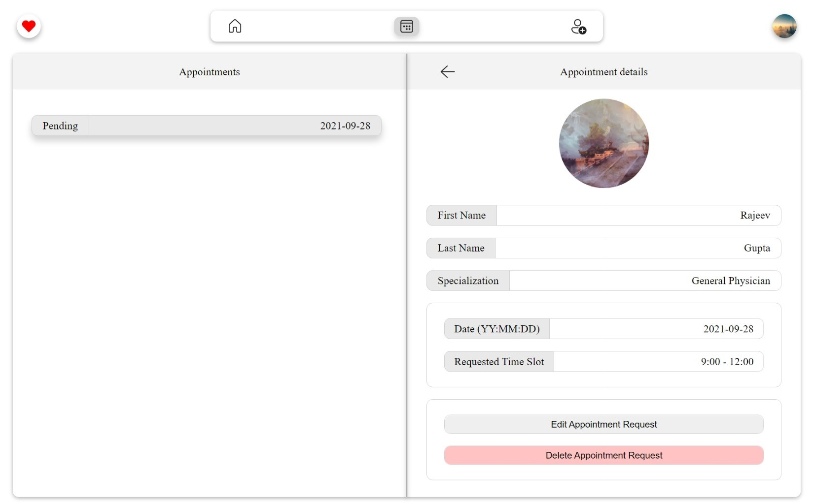
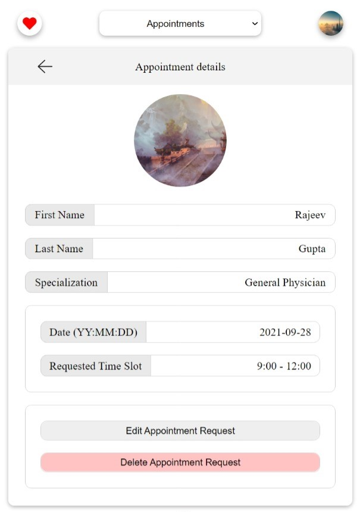

## Django Medical App

This is a medical application to connect patients directly to doctors. It's a single page React website with a Django backend. Users can be either patients or doctors. Patients can request appointments using this and the doctors can accept or reject them.


\
\
\


## How to run this project

### With Docker
Run:
```
docker-compose up
```

### Without Docker
In the base directory run:

```
python manage.py makemigrations
python manage.py migrate
python manage.py runserver
```

To make changes to the frontend, first `cd` into `frontend` in a separate terminal and  run:

```
npm install
```

to install `react`, `react-dom` and `react-router`

To make changes appear while editing, run:

```
npm run dev
```

or after making changes run:

```
npm run build
```

To change the styling, `cd` into `frontend/static/css` and run:

```
sass index.scss:index.css --watch
```
